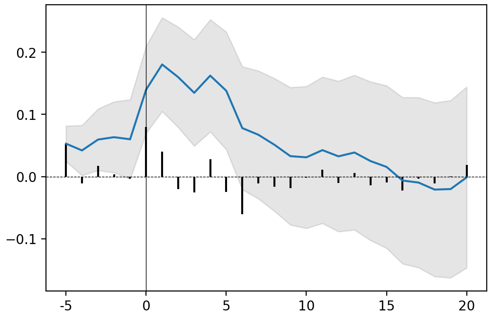
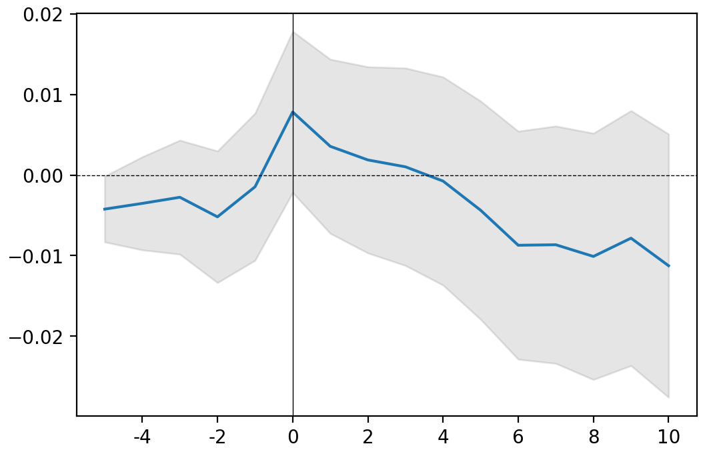

# Event Studies Package Documentation

This document serves as the comprehensive user guide, API reference, and methodology manual for `ffjr-eventstudies`.

---

## Table of Contents
1. [Installation & Setup](#1-installation--setup)
2. [Get Started Guide](#2-get-started-guide)
   - [Preliminary Work](#preliminary-work)
   - [Example 1: A Single Event](#example-1-a-single-event)
   - [Example 2: Multiple Events (Aggregated)](#example-2-multiple-events-aggregated)
   - [Advanced Example: Programmatic Loops](#advanced-example-programmatic-loops)
3. [Excel Exporter](#3-excel-exporter)
4. [Fama-French & Carhart Portfolio Construction Theory](#4-fama-french--carhart-portfolio-construction-theory)
5. [API Reference](#5-api-reference)
   - [SingleEvent Class](#singleevent-class)
   - [MultipleEvents Class](#multipleevents-class)
   - [Utility Functions](#utility-functions)

---

## 1. Installation & Setup

Install the stable release via PyPI:
```bash
pip install ffjr-eventstudies
```

Or install the development version from source:
```bash
git clone https://github.com/rla3rd/eventstudies.git
cd eventstudies
pip install -e .
```

### Core Requirements
- **Python:** 3.10 or higher
- **Libraries:** `numpy`, `pandas`, `scipy`, `statsmodels`, `matplotlib`, `seaborn`, `pandas_datareader` (for fetching market data), `openpyxl` (for Excel export)

---

## 2. Get Started Guide

### Preliminary Work

Before running event studies, you must import the package and load historical security return data.

```python
import eventstudies as es
from eventstudies import SingleEvent, MultipleEvents
import numpy as np
import matplotlib.pyplot as plt

# Option 1: Fetch stock data and create a returns parquet file
from eventstudies.util import create_returns_parquet
create_returns_parquet(
    tickers=['AAPL', 'GOOGL', 'MSFT', 'SPY'],
    output_path='data/market/returns.parquet',
    start_date='2020-01-01',
    end_date='2023-12-31',
    data_source='yahoo',
    use_adjusted=True
)
SingleEvent.import_returns(path='data/market/returns.parquet')

# Option 2: Import from a pandas DataFrame
# import pandas as pd
# returns_df = pd.read_csv('returns.csv', parse_dates=['date'])
# SingleEvent.import_returns(dataframe=returns_df)

# Option 3: Download and calculate log returns using Tiingo
# from eventstudies import tiingo
# raw_prices = tiingo.download_prices(
#     tickers=['AAPL', 'GOOGL', 'MSFT', 'SPY'],
#     api_key='YOUR_TIINGO_API_KEY', # or leave blank to load from env TIINGO_API_KEY
#     start_date='2020-01-01',
#     end_date='2023-12-31'
# )
# wide_returns = tiingo.to_logreturns(raw_prices, calendar='NYSE')
# SingleEvent.import_returns(dataframe=wide_returns)

# Load Fama-French factors (fetches factors from Kenneth French's library via pandas_datareader)
SingleEvent.import_FamaFrench()
```

---

### Example 1: A Single Event

Run a single-event study of the announcement of the first iPhone on January 9, 2007, using the Fama-French 3-factor model.

```python
# Run the event study
event = SingleEvent.FamaFrench3(
    ticker = 'AAPL',
    event_date = np.datetime64('2007-01-09'),
    event_window = (-2, +10),  # T2 to T3
    est_size = 252,           # OLS estimation window [T0, T1]
    buffer_size = 21          # Buffer window [T1, T2]
)

# Plot the Abnormal Returns (AR) and Cumulative Abnormal Returns (CAR)
event.plot(AR=True, CI=True, confidence=0.90)
plt.show()



# Get the results table as a pandas DataFrame
df_results = event.results(decimals=3)
print(df_results.head())
```

#### Significance Asterisks in Table Output
Asterisks are added automatically to highlight the level of significance:
* `***` significant at 99% ($p < 0.01$)
* `**` significant at 95% ($p < 0.05$)
* `*` significant at 90% ($p < 0.10$)

---

### Example 2: Multiple Events (Aggregated)

To analyze the aggregate impact of multiple events (e.g., annual 10-K releases), use `MultipleEvents`. This aggregates results into Average Abnormal Returns (AAR) and Cumulative Average Abnormal Returns (CAAR).

Input data can be in a CSV, a list, or a pandas DataFrame. Columns must match the parameters of the chosen `event_model` (e.g., `ticker`, `mkt_idx`, and `event_date`).

`10K.csv` example:
```csv
ticker,mkt_idx,event_date
AAPL,SPY,2019-10-31
GOOG,SPY,2020-02-04
MSFT,SPY,2019-08-01
```

```python
# Run aggregate event study using Market Model
release_10K = MultipleEvents.from_csv(
    path = '10K.csv',
    event_model = SingleEvent.MarketModel,
    event_window = (-5, +10),
    est_size = 200,
    buffer_size = 30,
    sep = ',',
    ignore_errors = True  # Skips events with missing data
)

# Plot CAAR
release_10K.plot(confidence=0.95)
plt.show()



# Get AAR and CAAR table
summary_df = release_10K.results()
print(summary_df)

# Get CAR distribution statistics on day +4
car_dist = release_10K.get_CAR_dist(4)
print(car_dist)
```

---

### Advanced Example: Programmatic Loops

You can filter and compute studies programmatically:

```python
events_db = [
    {'ticker': 'AAPL', 'mkt_idx': 'SPY', 'event_date': np.datetime64('2019-10-31')},
    {'ticker': 'AAPL', 'mkt_idx': 'SPY', 'event_date': np.datetime64('2018-11-05')},
    {'ticker': 'GOOG', 'mkt_idx': 'SPY', 'event_date': np.datetime64('2020-02-04')},
]

tickers = ['AAPL', 'GOOG']
releases = {}

for ticker in tickers:
    ticker_events = [e for e in events_db if e['ticker'] == ticker]
    releases[ticker] = MultipleEvents.from_list(
        event_list = ticker_events,
        event_model = SingleEvent.FamaFrench3,
        event_window = (-5, +10)
    )
```

---

## 3. Excel Exporter

Export rich formatted reports with native Excel charts using the `excel_exporter` module:

```python
from eventstudies import SingleEvent, excel_exporter
import numpy as np

event = SingleEvent.MarketModel(
    ticker='AAPL',
    mkt_idx='SPY',
    event_date=np.datetime64('2007-01-09'),
    event_window=(-5, +10)
)

# Export single event study (adds Summary sheet + native chart)
event.to_excel('results.xlsx')

# Export multiple events study
from eventstudies import MultipleEvents
events = MultipleEvents.from_list(event_list=[...], event_model=SingleEvent.MarketModel)
events.to_excel('multiple_results.xlsx', event_details=True, chart_as_picture=True)
```

### `to_excel()` Parameters
- **`path`** (str): Target filename.
- **`chart_as_picture`** (bool, optional): If `True`, inserts the chart as a static PNG image. If `False`, builds a native Excel chart object. Default: `False`
- **`event_details`** (bool, optional): For `MultipleEvents`, if `True`, creates an individual worksheet for each event in the sample. Default: `True`

---

## 4. Fama-French & Carhart Portfolio Construction Theory

Replicating factors (e.g., SMB, HML, RMW, CMA, WML) requires specific mapping rules.

### Breakpoints (NYSE Only)
To prevent small, illiquid micro-caps from dominating and skewing the sorting thresholds, breakpoints must be computed using **NYSE-listed stocks only** as the reference:
* **Size Threshold:** Median NYSE Market Equity (ME) in June of year $t$.
* **Book-to-Market (B/M) Thresholds:** 30th and 70th NYSE percentiles in June of year $t$.
* **Operating Profitability (OP) Thresholds:** 30th and 70th NYSE percentiles in June of year $t$.
* **Investment (INV) Thresholds:** 30th and 70th NYSE percentiles in June of year $t$.
* **Momentum (MOM) Thresholds:** 30th and 70th NYSE percentiles of $(t-12, t-2)$ returns.

### Classification (NYSE, AMEX, NASDAQ)
Once breakpoints are calculated, all active common equities (excluding OTCBB/Pink Sheets) are sorted into portfolios using those NYSE-derived thresholds.

### Factor Return Formulae
All portfolios are value-weighted.
* **HML (High Minus Low):** $\frac{(S/H + B/H)}{2} - \frac{(S/L + B/L)}{2}$
* **RMW (Robust Minus Weak):** $\frac{(S/R + B/R)}{2} - \frac{(S/W + B/W)}{2}$
* **CMA (Conservative Minus Aggressive):** $\frac{(S/C + B/C)}{2} - \frac{(S/A + B/A)}{2}$
* **WML (Momentum):** $\frac{(S/U + B/U)}{2} - \frac{(S/D + B/D)}{2}$ (re-sorted monthly)
* **SMB (Small Minus Big):** Average size premium across the three sorts:
  $$SMB = \frac{SMB_{B/M} + SMB_{OP} + SMB_{INV}}{3}$$

---

## 5. API Reference

### SingleEvent Class

#### `SingleEvent(model_func, model_data, ticker=None, mkt_idx=None, event_date=None, event_window=(-5, +5), est_size=252, buffer_size=21, weight=1, description=None)`
Core constructor to execute custom models.

#### Models
*   **`SingleEvent.OrdinaryReturnsModel(ticker, event_date, event_window=(-5, +5), est_size=252, buffer_size=21)`**
    Expected return is $0$. AR is raw returns.
*   **`SingleEvent.MeanAdjustedModel(ticker, event_date, event_window=(-5, +5), est_size=252, buffer_size=21)`**
    Expected return is the average return over the estimation window.
*   **`SingleEvent.MarketAdjustedModel(ticker, mkt_idx, event_date, event_window=(-5, +5), est_size=252, buffer_size=21)`**
    Expected return is the market return.
*   **`SingleEvent.MarketModel(ticker, mkt_idx, event_date, event_window=(-5, +5), est_size=252, buffer_size=21)`**
    Single-variable OLS regression: $R_{it} = \alpha_i + \beta_i R_{mt} + \epsilon_{it}$.
*   **`SingleEvent.FamaFrench3(ticker, event_date, event_window=(-5, +5), est_size=252, buffer_size=21)`**
    OLS regression using Fama-French 3 Factors (Mkt-RF, SMB, HML).
*   **`SingleEvent.FamaFrench5(ticker, event_date, event_window=(-5, +5), est_size=252, buffer_size=21)`**
    OLS regression using Fama-French 5 Factors (Mkt-RF, SMB, HML, RMW, CMA).
*   **`SingleEvent.Carhart(ticker, event_date, event_window=(-5, +5), est_size=252, buffer_size=21)`**
    OLS regression using Fama-French 3 Factors + Momentum (MOM).

#### Methods
*   **`import_returns(path=None, dataframe=None)`**
    Load historical daily returns. Accepts a path to a parquet file or a pandas DataFrame (wide format: index as dates, tickers as columns).
*   **`import_FamaFrench()`**
    Fetches Fama-French factors from the Kenneth French Data Library.
*   **`results(asterisks=True, decimals=4)`**
    Returns a pandas DataFrame containing: `AR`, `Variance AR`, `CAR`, `Variance CAR`, `T-stat`, and `P-value`.
*   **`plot(CI=True, confidence=0.90, AR=False)`**
    Generates a matplotlib plot showing CAR and confidence intervals.

---

### MultipleEvents Class

#### Ingestion Constructors
*   **`MultipleEvents.from_csv(path, event_model, event_window, est_size, buffer_size, sep='|', ignore_errors=True)`**
*   **`MultipleEvents.from_list(event_list, event_model, event_window, est_size, buffer_size, ignore_errors=True)`**
*   **`MultipleEvents.from_pandas(df, event_model, event_window, est_size, buffer_size, ignore_errors=True)`**
*   **`MultipleEvents.from_text(text, event_model, event_window, est_size, buffer_size, sep='|', ignore_errors=True)`**

#### Methods
*   **`results(asterisks=True, decimals=4)`**
    Returns a pandas DataFrame of AAR, CAAR, T-stat, and P-value.
*   **`plot(CI=True, confidence=0.95)`**
    Plots the CAAR and confidence intervals.
*   **`get_CAR_dist(T)`**
    Returns descriptive statistics (Mean, Variance, Kurtosis, Min, Quantiles, Max) of CARs on event day $T$.
*   **`error_report()`**
    Returns a DataFrame containing details and traceback reasons for any events that failed during computation.

---

### Utility Functions

#### `create_returns_parquet(tickers, output_path, start_date, end_date, data_source='yahoo', use_adjusted=True)`
Fetches EOD stock prices from pandas-datareader sources, converts them to daily log returns, formats them as a wide-form table, and writes them to a parquet file.

---

### Tiingo Integration

The `eventstudies.tiingo` module provides helper utilities to download historical data directly from the Tiingo API and format it cleanly for use.

#### `tiingo.download_prices(tickers, api_key=None, start_date=None, end_date=None, delay=0.5)`
Downloads historical daily EOD price data for a list of tickers.
* **`tickers`** (List[str]): List of ticker symbols to download.
* **`api_key`** (str, optional): Your Tiingo API token. If omitted, attempts to read it from the `TIINGO_API_KEY` environment variable.
* **`start_date`** (str, optional): Start date in `YYYY-MM-DD` format.
* **`end_date`** (str, optional): End date in `YYYY-MM-DD` format.
* **`delay`** (float, optional): Spaced delay (seconds) between requests to prevent rate limit throttling. Default: `0.5`
* **Returns:** A long-format pandas DataFrame with columns `['date', 'ticker', 'adjClose']`.

#### `tiingo.to_logreturns(prices_df, calendar='NYSE')`
Processes the downloaded long-format DataFrame and returns the wide-format log returns table.
* **`prices_df`** (pandas.DataFrame): The DataFrame returned by `download_prices`.
* **`calendar`** (str, optional): The name of the `pandas_market_calendars` trading calendar to filter dates by. Default: `'NYSE'`
* **Returns:** A wide-format pandas DataFrame with date as index and tickers as columns.
